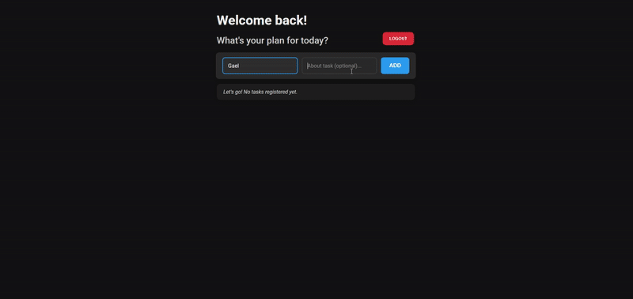

<div align="center">

[](https://shields.io/) []([https://GitHub.com/Naereen/ama](https://github.com/Eduardo-Salvador)) 
# To Do App - PHP

This is a simple web application project for learning purposes. It is a To Do list built with **PHP**, **HTML**, and **CSS**. The project demonstrates CRUD operations, user authentication, session control, and database management.

## Technologies
   

</div>

## Watch demo by clicking here: 

<div align="center">

[](https://youtu.be/6ZtQthBZtX0)

</div>

## Installation and Usage:

#### 1. Download XAMPP
- Visit the official website and download the latest version:
```
https://www.apachefriends.org
```
 - Click on "Download" for Windows.

#### 2. Run the Installer

- Double-click the downloaded ```.exe``` file
- If Windows shows a warning, click "Yes" to allow
- Click "Next" through the setup wizard
- Select components (Apache, PHP, MySQL are required)
- Choose installation directory (default: C:\xampp)
- Click "Next" and then "Finish"

#### 3. Start XAMPP Control Panel

- Open XAMPP Control Panel from Start Menu or Desktop
- Click "Start" button next to Apache
- Click "Start" button next to MySQL
- Both modules should show green "Running" status

#### 4. Test Your Installation
   
Open your web browser and go to:
```http://localhost```

- You should see the XAMPP welcome page.
- Creating Your First PHP Project
- Navigate to htdocs folder
- Open Windows Explorer and go to:
```C:\xampp\htdocs```

##### 5. Download project and create folder in:
```C:\xampp\htdocs\Virtual-Store-PHP_SESSION_Control```

##### 6. View in browser

- Open your browser and visit:
```http://localhost/Virtual-Store-PHP_SESSION_Control```

## Features

- User registration
- Login and session management
- Create, edit, mark as done, and delete tasks
- Simple and responsive interface


## Project Structure

- `Controller/` – Handles the main logic for user actions and tasks
- `Model/` – Database connection and queries
- `View/` – HTML templates and forms
- `assets/` – CSS files and images
